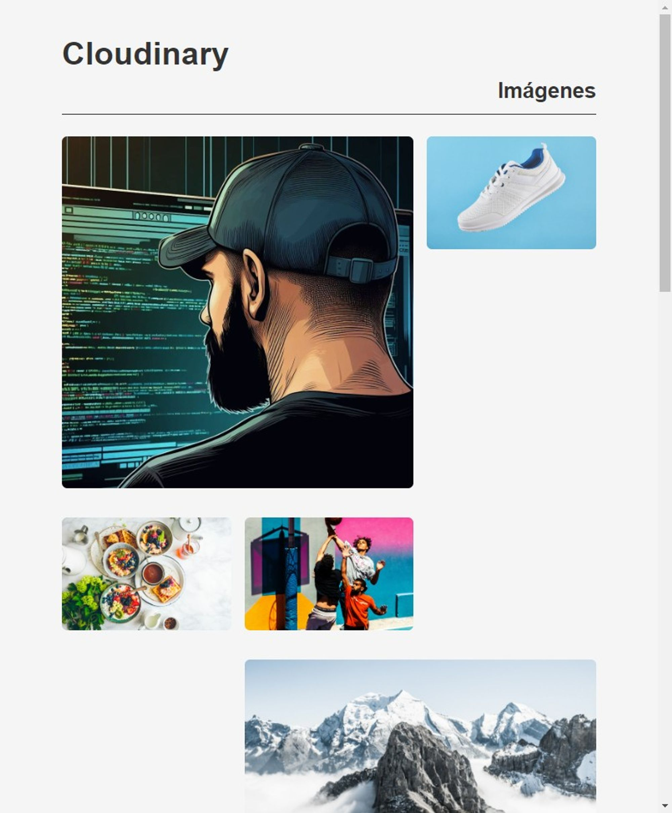

# README.md

### **Cloudinary Fetcher running in Cloudflare Worker**

This JavaScript script runs in a Cloudflare Workers environment and is used to fetch and format resources from Cloudinary, a digital asset management service.

### **Functions**

- **`fetch(request, env, ctx)`**: This asynchronous function serves as the script's entry point. It retrieves the necessary environment variables for authenticating with Cloudinary and then calls the **`getAllResources(type)`** function to fetch all image and video resources. It formats these resources into HTML and returns an HTML response.
- **`getAllResources(type)`**: This asynchronous function retrieves all resources of a specific type (images or videos) from Cloudinary. It uses a **`do...while`** loop to make requests to the Cloudinary API until there are no more resources to fetch.
- **`getNextCursor(responseData)`**: This function returns the cursor for the next page in the API response or **`null`** if there's no next page cursor.
- **`formatResources(resources, type)`**: This function takes an array of resources and a resource type, returning an HTML string representing the resources.

### **Usage**

To use this script, you'll need to configure the following environment variables:

- **`CLOUD_NAME`**: Your Cloudinary cloud name.
- **`API_KEY`**: Your Cloudinary API key.
- **`API_SECRET`**: Your Cloudinary API secret.

Then, you can deploy this script on a Cloudflare Worker and make requests to it to get an HTML response with your formatted Cloudinary resources.

### **Response Example**

The HTML response generated by this script will include sections for images and videos, each with corresponding resources formatted as **`article`** elements. Each resource will include a link to the resource in Cloudinary and, in the case of videos, playback controls.

Additionally, the response will include a link to return to the top of the page and a script to adjust the layout of the last row of resources if its length is odd.
